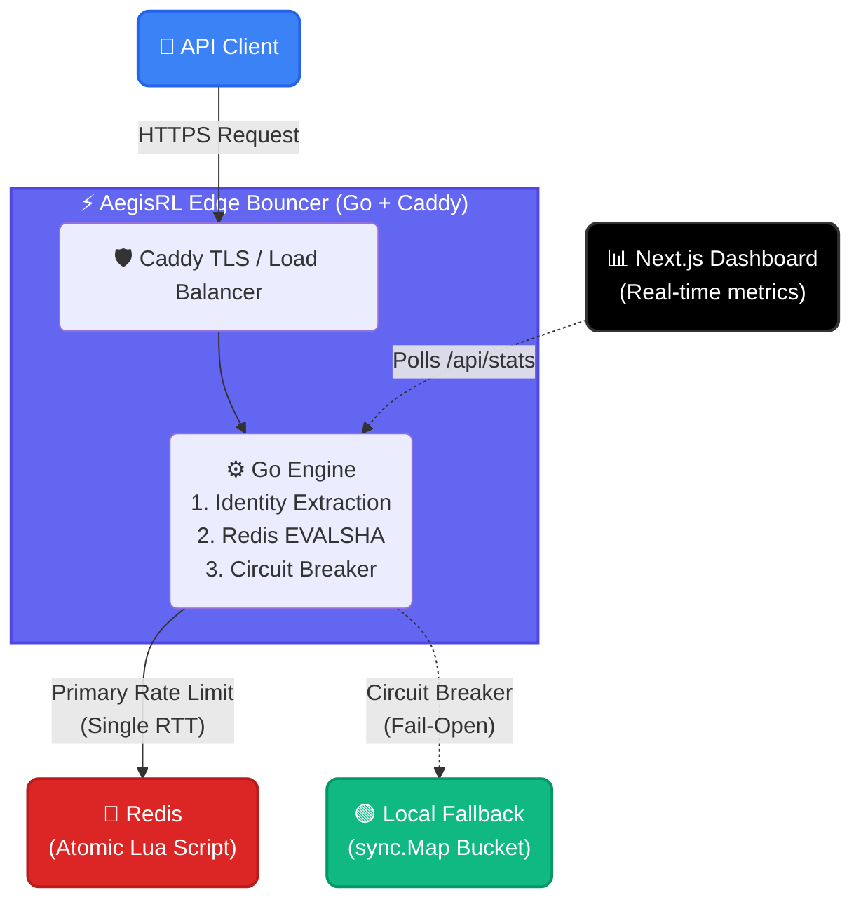

<div align="center">

# <i class="fa-solid fa-bolt"></i> AegisRL

**High-performance, production-grade distributed rate limiter and edge metering engine — Go engine, Atomic Redis Lua, Next.js terminal.**

[](https://go.dev)
[](https://redis.io)
[](#-real-time-dashboard)
[](LICENSE)
[](#-docker-compose-full-stack)

*Sub-millisecond decision latency, atomic read-modify-write without race conditions, circuit breaker resilience with fail-open local fallback, and a premium dark-mode Next.js real-time monitoring dashboard.*

</div>

---

## 🖥️ Real-Time Dashboard

The engine ships with a decoupled observability stack:

- **`/api`** — Go backend wrapping the core rate limiting logic. Exposes lightweight endpoints for health checks, real-time statistics polling (`/api/stats`), configuration reads (`/api/config`), and demo routes.
- **`/dashboard`** — Next.js 16 + Tailwind CSS terminal UI: 
  Live traffic area charts (Recharts), animated metric counters, interactive burst-request testers, active tier configuration table, and a system status panel showing engine health and Redis connectivity. Premium dark glassmorphism built to feel like an edge control center.

**Deploy:** backend → Docker/Go (`Dockerfile`), frontend → Vercel/Node (root dir `dashboard`). The `docker-compose.yml` spins up 2 Go replicas, Redis, Caddy (LB), and Prometheus.

---

## 🎯 Highlights

- **Atomic Token Bucket (Lua):** Executes GET→REFILL→CHECK→DECREMENT in a single RTT within Redis. Guaranteed zero race conditions under high concurrency. Optimized with `EVALSHA` to prevent sending the full script over the wire.
- **Resilience That Fights Outages:** A built-in Circuit Breaker pattern tracks Redis health (Closed → Open → HalfOpen). If Redis drops, the engine instantly fails-open to a `sync.Map`-based in-process local token bucket, keeping your APIs alive in "degraded mode".
- **Multi-Tier Metering:** Configurable Free, Pro, and Enterprise tiers. Rate limits and burst capacities are resolved dynamically based on API keys.
- **Spoof-Safe Identity Extraction:** Trusts `X-Forwarded-For` only for the last hop inside a trusted proxy network, preventing IP spoofing from malicious clients while correctly identifying the true origin.
- **Sub-Millisecond Speed:** Memory structures optimized for cache-locality. The `sync.Map` local fallback processes 10M+ operations per second, and Redis Lua calls reliably execute in < 1ms on the same network.
- **Production Observability:** Wires standard Prometheus counters, latency histograms, and circuit breaker state gauges. Structured JSON logging via `zap` ensures compatibility with modern log aggregators.

---

## 🏗️ Architecture



---

## ✨ Key Features

| Feature | Description |
|---------|-------------|
| **Atomic Decisions** | `EVALSHA` Redis Lua script eliminates read-modify-write race windows entirely. |
| **Circuit Breaker** | Tracks consecutive Redis failures. 5 errors open the circuit. Cooldown probes self-heal. |
| **Degraded Mode** | In-process `sync.Map` bucket takes over automatically when Redis is down (Fail-Open). |
| **API Key Tiers** | Resolves limits by checking API keys against a hot-reloadable tier store (Free/Pro/Enterprise). |
| **Endpoint Rules** | Longest-prefix matching allows custom rate limits for specific intensive endpoints (`/api/search`). |
| **Spoof-Safe IP** | Strict IP extraction trusts only the last proxy hop, ignoring malicious `X-Forwarded-For` headers. |
| **O(1) Memory** | Redis script stores just 2 fields per client (tokens + timestamp) with TTL auto-eviction. |
| **Metrics** | Built-in Prometheus `/metrics` endpoint with counters, decision latency, and circuit gauges. |

---

## 🚀 Quick Start

### Prerequisites
- Go 1.23+
- Node.js 22+
- Docker & Docker Compose

### Local Development

```bash
# 1. Start Redis
docker run -d --name redis -p 6379:6379 redis:7-alpine

# 2. Run the Go Edge Engine (Terminal 1)
go run ./cmd/server

# 3. Start Next.js Dashboard (Terminal 2)
cd dashboard
npm install
npm run dev
```

Test the engine directly:
```bash
curl -i -H "X-API-Key: pro-key" http://localhost:8081/api/test
```

### Docker Compose (Full Stack)

Deploys 2x Go Engine Replicas, Redis, Caddy (Load Balancer & Auto TLS), and Prometheus.

```bash
# Start the full stack
make docker-up

# View aggregated logs
make docker-logs

# Tear down
make docker-down
```

---

## 📊 API & Response Headers

| Endpoint | Method | Auth | Description |
|---|---|---|---|
| `/healthz` | GET | No | Liveness check (used by Caddy) |
| `/api/test` | GET | Optional | Rate limited demo endpoint |
| `/api/stats` | GET | No | Real-time JSON stats for dashboard |
| `/api/config`| GET | No | Current tier parameters |
| `/metrics` | GET | No | Prometheus metrics (runs on `METRICS_ADDR`) |

Every protected response injects deterministic rate-limit headers:
- `X-RateLimit-Limit` — max token capacity
- `X-RateLimit-Remaining` — tokens available after this request
- `X-RateLimit-Reset` — Unix timestamp when bucket is completely full
- `X-RateLimit-Mode` — `degraded` (injected only if running on local fallback)
- `Retry-After` — seconds to wait (injected on HTTP 429 only)

---

## 📁 Project Structure

```
aegis-rl/
├── cmd/server/                 # Entrypoint: config wiring, middleware chain, server init
├── internal/
│   ├── limiter/                # Core logic, Redis EVALSHA, Circuit Breaker, Local Fallback
│   ├── middleware/             # HTTP RateLimit wrapper, Spoof-Safe Identity, CORS
│   ├── config/                 # Env-based config, Multi-Tier structs
│   ├── metrics/                # Prometheus metrics definitions
│   ├── logging/                # Structured Zap logger
│   └── handlers/               # Route controllers (Stats, Demo, Health)
├── scripts/                    # Raw Lua scripts for Redis algorithms (Token Bucket, GCRA)
├── dashboard/                  # Next.js 16 + Tailwind real-time dashboard UI
├── deployments/                # Docker Compose, Caddyfile, Prometheus config
├── bench/                      # Vegeta load-testing and chaos testing scripts
└── Makefile                    # Build, test, benchmark, and docker targets
```

---

## 🧪 Testing & Benchmarking

The project contains a comprehensive test suite (20 tests) protecting identity spoofing, circuit breaker state transitions, and high-concurrency race conditions.

```bash
# Run unit tests and static analysis
make test
make vet
make race     # Run with Go race detector
make escape   # View memory escape analysis
```

**Vegeta Load Testing:**
```bash
# Run a steady 300 RPS load test and plot results
make vegeta

# Chaos Test: kill Redis mid-load and watch the P99 latency safely fallback!
./bench/chaos-test.sh http://localhost:8081/api/test redis
```

---

## 🔧 Configuration

Defaults live in `internal/config/config.go` but can be entirely overridden via environment variables:

| Env Variable | Default | Description |
|---|---|---|
| `LISTEN_ADDR` | `:8081` | Main server bind address |
| `METRICS_ADDR` | `:9100` | Prometheus metrics bind address |
| `REDIS_ADDR` | `localhost:6379` | Redis connection string |
| `CAPACITY` | `100` | Default burst size for unknown clients |
| `REFILL_RATE` | `10` | Default tokens/sec refill rate |
| `TIMEOUT_MS` | `50` | Redis call timeout |
| `TRUST_PROXY` | `false` | Set true behind Cloudflare/ALB to parse XFF correctly |

---

## 📄 License

MIT — see [LICENSE](LICENSE).

---

<div align="center">

**Built by [Akshit Kumar Tiwari](https://github.com/RintuRifle)**

*If you found this useful, give it a ⭐ on GitHub!*

</div>
